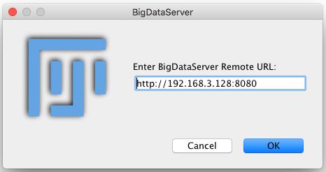
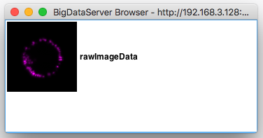

# How to start BigDataServer (BDS)

Starting one's own [BDS](https://imagej.net/BigDataServer) requires a few things:
- have a computer available with BDS software installed,
- have Mastodon project file `.mastodon` that points on<br/>
  a [BigDataViewer](https://imagej.net/BigDataViewer) dataset in
  the [format of XML/HDF5](https://imagej.net/BigDataViewer.html#Multi-view_data_converted_to_XML.2FHDF5),
- start the BDS and point it on the dataset,
- finally, adapt the dataset `.xml` file to use data from the BDS.


## Starting BDS
[Just like for the collaborative server](SERVER.md), say one have a computer of
H_BDS hostname (or IP address) and with available port P_BDS to run the BDS.
Considering the pair H:P from the collaborative server, H can be the same as
H_BDS, or P_BDS can be the same as P, but not both at the same time.
Furthermore, let BDSJAR be path to a `.jar` file with BDS.

One can download BDSJAR [from this URL](http://fly.mpi-cbg.de/~pietzsch/bigdataserver.jar),
in which case BSDJAR would be `bigdataserver.jar`.

To test if you BDS is functional, try:
```
JAVA -jar BDSJAR
```
which should say something like
```
usage: BigDataServer [OPTIONS] [NAME XML] ...

Serves one or more XML/HDF5 datasets for remote access over HTTP.
... (more lines) ...
```


## Share XML/HDF5 dataset with BDS
Assuming your `.mastodon` project file refers to some nearby `dataset.xml`
(example name, could be different but `.xml` is a must) that refers to some
`bigImageData.h5` (example again, but `.h5` is a must).

Create a duplicate/copy `datasetLOCAL.xml` of the original `dataset.xml`
because the latter will be changed below.

One can start BDS serving this particular dataset as follows:
```
JAVA -jar BDSJAR -s H_BDS -p P_BDS  S datasetLOCAL.xml
```
where S can be any identifying keyword, most ideally it could be [the `string`
of the project](PROJECTS.md).

Again, the [similar discussion applies](SERVER.md) regarding stopping
and restarting the server.

To test if BigDataServer started to serve a particular dataset via
```
java -jar bigdataviewer-server-3.0.1-SNAPSHOT.jar -s 192.168.3.128 -p 8080  rawImageData ~/Mette/e1/processed_movie_hdf5_xml/dataset_hdf5.xml
```
is functional and reachable, one can open Fiji, choose Plugins -> BigDataViewer ->
Browse BigDataServer and enter the URL:

   ->   

A white window should show up with just one line showing icon of the server
dataset and text "rawImageData" next to it.


## Adjust XML/HDF5 to use BDS
Now that the BDS is running, it remains to adjust/instruct the already-cloned
`dataset.xml` file to use the BDS.

The `dataset.xml` is the entry point to XML/HDF5 image data. It knows which
`.h5` files are holding the raw data and where they are on the hard drive.
The main Mastodon project file `.mastodon` does not care how `dataset.xml`
fetches image data, so we don't need to change the `.mastodon` file.

To switch `dataset.xml` to use BDS, the following snippet
```
    <ImageLoader format="bdv.hdf5">
      <hdf5 type="relative">bigImageData.h5</hdf5>
		... (potentially many lines) ...
    </ImageLoader>
```
needs to be replaced with the following three lines
```
    <ImageLoader format="bdv.remote">
		<baseUrl>http://192.168.3.128:8080/rawImageData/</baseUrl>
    </ImageLoader>
```
and save (overwrite) it with the original filename (here as `dataset.xml`).

The snippet is usually close to very top of the `.xml` file.
The lines may vary slightly between projects, but the principle will
always be the same. Of course, replace the actual IP address (192.168.3.128),
port (8080) and dataset string (rawImageData) with appropriate values.<br/>
The **template is** `http://H_BDS:P_BDS/S` (see above).

To test if `dataset.xml` was fixed well, one can open Fiji, choose Plugins
-> BigDataViewer -> Open XML/HDF5, and point it on this `.xml` file.
BigDataViewer window should open up showing exactly the same raw data.

But mainly, however, if the `.mastodon` project file **together** with the
`dataset.xml` is moved elsewhere, even on another computer, the project should
display everything the same as before (as long as BDS is running).
