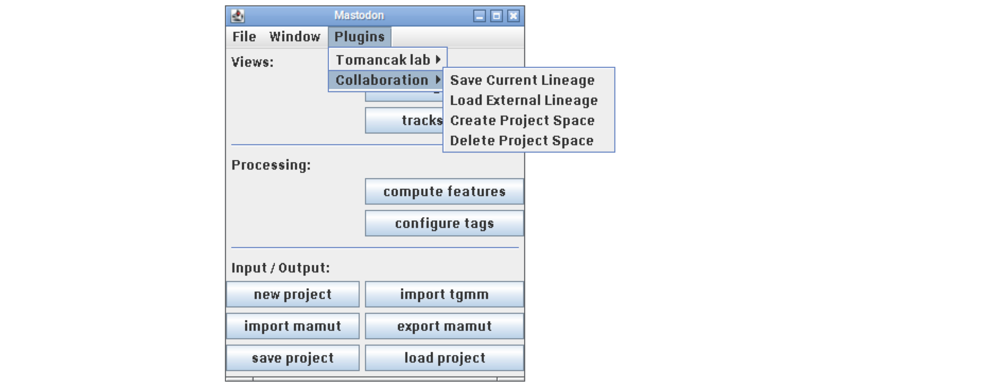
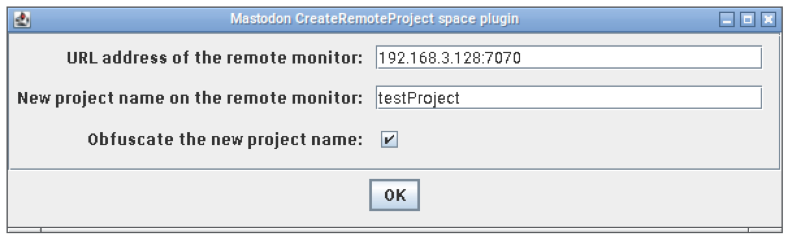
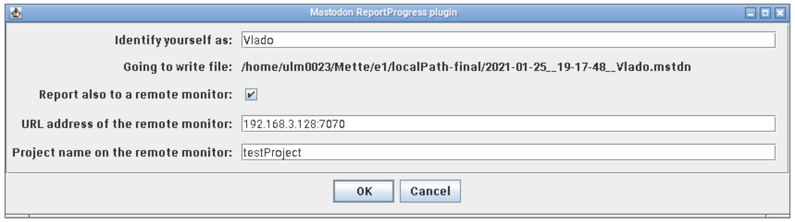
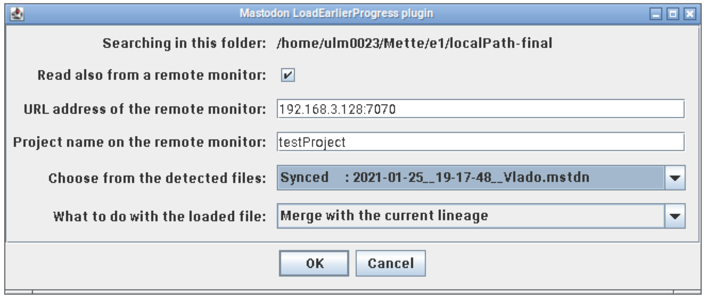
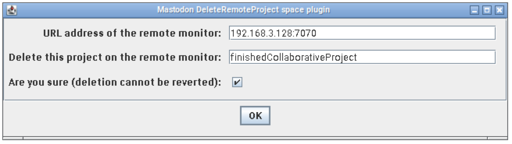
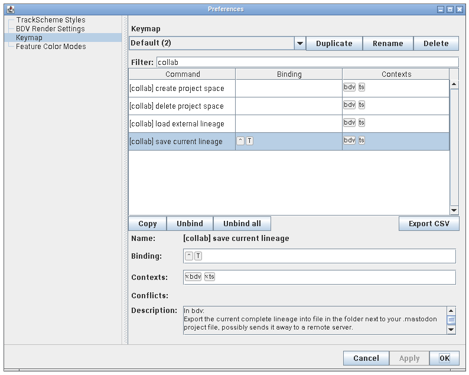

# What is mastodon-collaborative?
A suite of Mastodon plugins originally developed to foster collaborative tracking.

## The idea
The original purpose of this project was to enable tracking cells in the same
image data by multiple users (collaborators) independently, that is, on their
own laptops at their own pace. To make this effort an efficient one, ideally
users work in "separate corners" of the data so that no cell is tracked twice.
Users then somewhat regularly submit their current state of the work to a server.

The server is only a repository of tracking data from multiple users. It
collects contributions from users and offers it to anyone to download and to
incorporate into one's own tracking. Mastodon features simple-to-use plugins for
exactly these tasks. By design, the server does not automagically merge
anything into one giant tracking as this process can become fragile and must be
supervised if you want to trust the outcome of the collaborative tracking.

This concept requires a bit of an organization.
Ideally there is a project leader that
- prepares the Mastodon project,
- defines "separate (non-overlapping) corners" in the data,
- distribute project data to collaborators,
- explains and assigns work to collaborators,
- somewhat regularly merges recent contributions from the collaborators 
  to check for issues and to detect overlaps rather soon,
- stops the collaboration and merges to obtain the final tracking.

To avoid having (potentially large) image data copied on every laptop, one may
want to set up a [BigDataServer](https://imagej.net/BigDataServer) to [host the
image data, and adjust Mastodon project path accordingly](BDS.md).
Collaborators, when tracking, download online a piece of the data that is
currently processed (displayed) in their laptops.

[Here it is explained in 2.5 min long video-presentation.](https://www.fi.muni.cz/~xulman/files/Mastodon/Collab__whatIsItAbout.mkv)

## The snapshots
At the heart of these plugins is the ability to create-and-store a snapshot of
an annotation of one's own images, as well as to load-and-merge-in a snapshot.
The annotation consists of a lineage trees and tag sets, it does not involve
the image data per se. The snapshot of an annotation is the exact content of it
(all spots and their positions, labels, colors and links) available for the
given images at the given time.

A snapshot can be understood as a lightweight alternative to saving the full
project. The snapshot itself does not hold any reference to the original
project -- one can, for example, merge snapshot from different project into
a current one.

Snapshots can be used to store progress of an on-going annotation, can be used
as named points of restore, and can be exchanged among annotators --
collaborating Mastodon users.

The snapshot files use `.mstdn` extension whereas the full Mastodon project
files are using the `.mastodon` extension.

<!--
In the latter setting, users can agree to annotate mutually different
portions of the data and can work on their tasks simultaneously. This is
essentially a collaborative annotation of the data, which is further fostered
with a dedicated server implemented here to ease the snapshots exchange.
-->

## The server
The server is merely a convenient point of exchange of snapshots (or any files),
all organized into multiple projects.

To have own server running, one needs to have the following:
- Hosting computer accessible on a network
- Java 1.8 or newer installed
- Fiji with Mastodon installed
- Folder where server data will be stored

The hosting computer can be anything where Java runs. In particular it can be
Windows, Mac or Linux computer. And it can run only on local network unless one
wants to enable his collaborators to contribute from their homes or invite
collaborators from different institutions. In the latter two cases, please refer
to your system administrators to help you start the server on appropriately
accessible computers (e.g., via VPN, or with public IP address).

To start the server, one only needs to know how to open a command line, which could
be named variously in your operating system such as console, terminal or shell.
And then [look here to find the one-line command to start the server.](SERVER.md)

[It could be worthwhile to serve your image data too.](BDS.md)

# The project
Clearly, one server has to serve multiple collaborative endeavours, which is to
say, to serve multiple projects. It must separate and protect them from each other.
Here, it is achieved very straightforwardly.

A project is defined with a `string`, sequence of characters without blank spaces.
Examples can be from simple nickname-likes, e.g., "thirdEmbryo", to rather descriptive
ones such as "VladoLab_exp33_DAPIstainedNuclei_t2min_temp36C".

The `string` addresses a project. Whenever collaborators interfere with the
server, this `string` needs to be passed along for the server to understand
which project is the current communication related to. [Technical details
regarding projects are summarized on another page.](PROJECTS.md)

The server provides no mean for collaborators to list over projects it hosts.
Exception is the server administrator who has, of course, access to everything.
In general, however, one cannot access content without knowing a particular
`string`. To decrease a chance of guessing other project's `string`, we advice
to include long randomized sequence of characters (name obfuscation) into the
`string` (Fiji plugins from this suite can do this for you). This is popular
concept used in many online services.

## The project on a server
[Refer to this page to learn how projects are managed on the server.](PROJECTS.md)

## The project inside Mastodon

There are four Fiji plugins to utilize the life cycle of a collaborative project.

### Creating a new collaborative project

In this example, a project `string = testProject` is requested to be created on
the server that is expected to be reachable on IP address 192.168.3.128 and
port 7070. If the bottom toggle is checked, the *secret project* (its actual
`string` will include random character sequence) is created on the server. The
new project name should now be pre-filled in all plugins from this suite.

### Contributing current snapshot
When creating a snapshot, it is always created locally in the same folder next
to the main project file (the `.mastodon` file). Snapshot files use `.mstdn`
extension. One is expected, however, to also upload a snapshot to the dedicated
server. Make sure the toggle is checked to upload/report to the server as well.

To tell the content of snapshots apart, snapshot filenames are extended with any
user text such as collaborator's name or name of the "isolated corner" of the
tracked data. Please, avoid using "non-standard" characters and blank spaces.
Moreover, the names of snapshots always include time stamps.

Here, a snapshot is created and consequently stored locally under the reported
path. Since the "remote monitor" button is toggled, the snapshot file is also
uploaded on the server into "testProject" folder.

### Inspecting existing snapshots
When time is right, users might want to return to their previous work or inspect
the current work of others within the same project. A plugin, whose control
dialog is shown below, is available specifically for this task. This dialog
collects a list of available snapshots first and user is expected to choose one
and also choose what to do with it -- currently either to replace or merge with
the current content in user's local Mastodon. **Attention, plugin does not save
anything before its operation, user has to do it herself** (if she feels like...).

The snapshots are prefixed with one of three possible labels based on where they
do exists:
- `Local only:`  - stored previously but never contributed work of mine,
- `Synced:`      - either already contributed work of mine, or previously downloaded work and now cached,
- `Remote only:` - not yet downloaded work of others.

User is choosing, in this example, to open certain `synced` snapshot (that will
not be downloaded because it already exists locally) and to merge it with what
is currently in his Mastodon session.

The content of the "Choose from the detected files" field is a result of
inspection of the local folder and, since the checkbox is toggled, of the remote
server (at the given address, port and from the given project).

The list shall be updated in response to updates of the input fields of the dialog.
However, due to certain technical limits (of scijava automatic parameters
harvesting), if the toggle button is changed, the dialog needs to be opened
again (while its list is re-populated) to show the updated list. The previously
opened dialog windows will be deprecated, that means, they will just close
without doing anything when one clicks their "OK" or "Cancel" buttons.

### Deleting old collaborative project
Finally, when all is done, contributed work is merged, overlaps are resolved,
and **`.mastodon` project is saved**, one may want to remove the content on the
server.

The dialog asks to delete a project folder "finishedCollaborativeProject" on the
server. To prevent from unwanted effect of an accidental trigger of this menu,
no deletion takes place until the "are you sure" toggle is checked.

# Customizing the plugins
The plugins come with no predefined short-cuts but you can assign them shortcuts
yourself the [usual Mastodon way](https://github.com/mastodon-sc/mastodon#actions-and-keyboard-shortcuts).

One can add own keyboard shortcuts from Mastodon main window, choose
File -> Preferences..., choose the Keymap tab, then filter for "collab".
To define a favourite shortcut, click on the action (e.g., "save current
lineage"), click bottom to the field "Binding:" and type `ctrl`, hit space bar,
`T`, hit space bar. To test it, which is to have the dialog pop up after
pressing `Ctrl+T`, don't forget to click "Apply" in the dialog.
